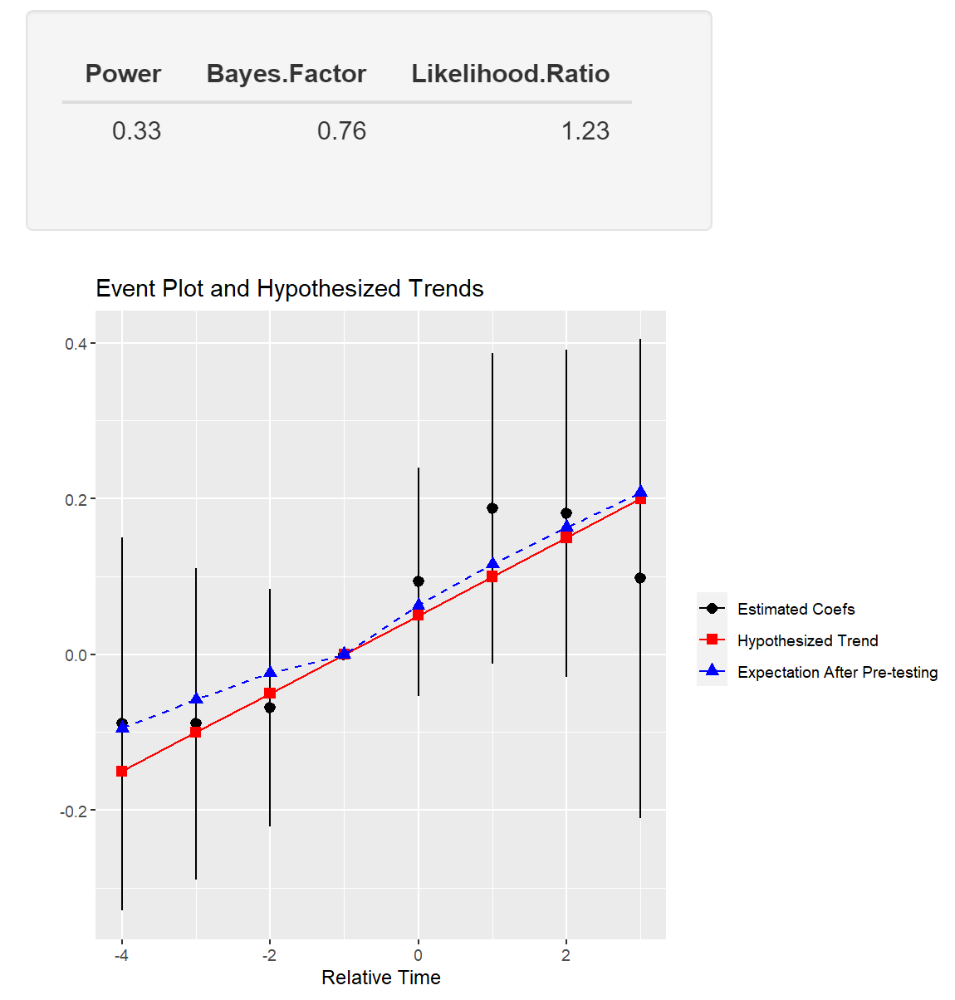

<!-- README.md is generated from README.Rmd. Please edit that file -->

# PretrendsPower

This is a Shiny application that enables power calculations for
pre-trends tests and visualization of possible violations of parallel
trends. Calculations are based on [Roth
(2020)](https://jonathandroth.github.io/assets/files/roth_pretrends_testing.pdf).
All input to the app is provided in CSV files, which facilitates
interaction with many different programming languages (R, Stata, Python,
etc.). See also the associated [R
package](https://github.com/jonathandroth/pretrends), which has detailed
documentation.

## Loading the app

There are two ways to use the Shiny app.

First, the application can be run locally in
[RStudio](https://www.rstudio.com/) with the following commands

``` r
#install.packages("shiny") #install Shiny if not installed
library(shiny)
shiny::runGitHub("PretrendsPower", "jonathandroth")
```

Second, there is an [online version of the
app](https://jonathandroth.shinyapps.io/pretrendspowerapp/).
Unfortunately, the free version of shinyapps limits total usage to 25
hours a month.

## Screenshot

Below is a screenshot of the user-interface of the app, which also
provides detailed use instructions.


